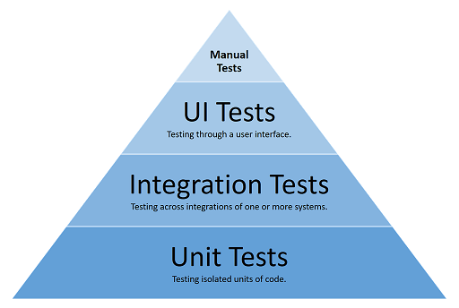
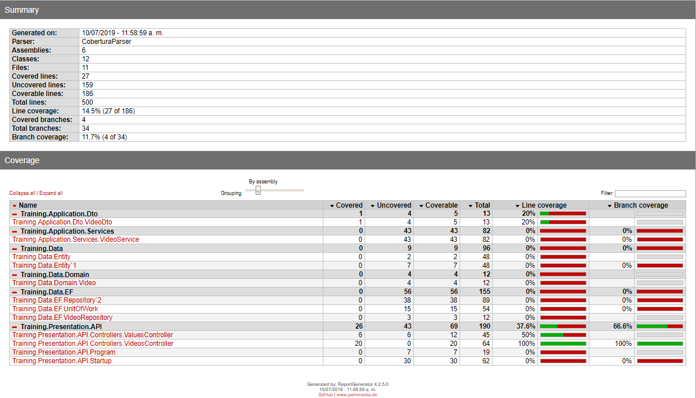

# .Net Core Training Course
.NET Core is a cross-platform, high-performance, [open-source](https://github.com/aspnet/home) framework for building modern, cloud-based, Internet-connected applications.
The purpose of this course is to give you the key concepts and topics to build .Net Core apps

## Summary

 - Fundamentals
	 - Overview
	 - CLI commands
	 - Startup Class
	 - Middleware
	 - Host
	 - Server
	 - Configuration
	 - Environments
	 - Logging
 -  Dependency Injection
	 - Fundamentals
	 - .Net Core DI
 - Data Layer
	 - ORM
	 - Patterns
	 - Entity Framework Core
 - Web Development
 - Security

# Fundamentals
**.NET Core** is a free and open-source managed computer software framework for the Windows, Linux, and macOS operating systems. It is an open source, cross platform successor of .NET Framework. The project is mainly developed by Microsoft and released under the MIT License.

## Download and Install
Please go to the official page from Microsoft and download the latest SDKavailable.
For this course we are going to work with .Net Core 2.2 Version downloaded form [MS Page](https://dotnet.microsoft.com/download).
Once you install the SDK, open a console window and type below comand to check the instalation:

    dotnet --info
You should see the information of the SDK installed as below image:

If you want to know more about installation process you can see this [link](https://dotnet.microsoft.com/learn/dotnet/hello-world-tutorial/intro)

## CLI Commands

When you install the SDK, it provides a comand line interface(CLI), this inteface is a cross platform command line tool used for developing and performing various development activities when developing .Net Core applications.

### Command structure
CLI command structure consists of the **driver** ("dotnet"), the **command** (or "verb"), and possibly command **arguments** and **options**. You see this pattern in most CLI operations, such as creating a new console app and running it from the command line as the following commands show when executed from a directory named _my_app_:

    dotnet new console 
    dotnet build --output /build_output 
    dotnet /build_output/my_app.dll

### Driver
The driver is named  **dotnet** and has two responsibilities, either running a  **framework-dependent app** or executing a command.
To run a framework-dependent app, specify the app after the driver, for example,  `dotnet /path/to/my_app.dll`. When executing the command from the folder where the app's DLL resides, simply execute  `dotnet my_app.dll`.

### Command
The command (or "verb") is simply a command that performs an action. For example,  `dotnet build`  builds your code.  `dotnet publish`publishes your code. The commands are implemented as a console application using a  `dotnet {verb}`  convention.

### Arguments
The arguments you pass on the command line are the arguments to the command invoked. For example when you execute  `dotnet publish my_app.csproj`, the  `my_app.csproj`  argument indicates the project to publish and is passed to the  `publish`  command.

### Options
The options you pass on the command line are the options to the command invoked. For example when you execute  `dotnet publish --output /build_output`, the  `--output`  option and its value are passed to the  `publish`  command.

The following commands are installed with the SDK as default:

| Command |Description  |
|--|--|
|new|`dotnet new` - Creates a new project, configuration file, or solution based on the specified template.|
|restore|`dotnet restore` - Restores the dependencies and tools of a project.|
|build|`dotnet build` - Builds a project and all of its dependencies.|
|publish|`dotnet publish` - Packs the application and its dependencies into a folder for deployment to a hosting system.|
|run|`dotnet run` - Runs source code without any explicit compile or launch commands.|
|test|`dotnet test` - .NET test driver used to execute unit tests.|
|vstest|`dotnet-vstest` - Runs tests from the specified files.|
|pack|`dotnet pack` - Packs the code into a NuGet package.|
|migrate|`dotnet migrate` - Migrates a Preview 2 .NET Core project to a .NET Core SDK 1.0 project.|
|clean|`dotnet clean` - Cleans the output of a project.|
|sln|`dotnet sln` - Modifies a .NET Core solution file.|
|help|`dotnet help` - Shows more detailed documentation online for the specified command.|
|store|`dotnet store` - Stores the specified assemblies in the [runtime package store](https://docs.microsoft.com/en-us/dotnet/core/deploying/runtime-store).|
|add package|`dotnet add package` - Adds a package reference to a project file.|
|add reference|`dotnet add reference` - Adds project-to-project (P2P) references.|
|remove package|`dotnet remove package` - Removes package reference from a project file.|
|remove reference|`dotnet remove reference` - Removes project-to-project references.|
|list reference|`dotnet list reference` - Lists project-to-project references.|

TO know more about CLI you can see this [link](https://docs.microsoft.com/en-us/dotnet/core/tools/?tabs=netcore2x)

## Startup Class
Every project on .Net Core has a StartUp Class, who is an entry point where services required by the app are configured and the pipeline or middleware components are defined.

To know more about Startup Class you can go to this [link](https://docs.microsoft.com/en-us/aspnet/core/fundamentals/startup?view=aspnetcore-2.2).

## Middleware

The request handling pipeline is composed as a series of middleware components. Each component performs asynchronous operations on an  `HttpContext`  and then either invokes the next middleware in the pipeline or terminates the request.

By convention, a middleware component is added to the pipeline by invoking its  `Use...`extension method in the  `Startup.Configure`  method. For example, to enable rendering of static files, call  `UseStaticFiles`.

To know more about Middleware you can go to this [link](https://docs.microsoft.com/en-us/aspnet/core/fundamentals/middleware/?view=aspnetcore-2.2).

## Host

An ASP.NET Core app builds a  _host_  on startup. The host is an object that encapsulates all of the app's resources, such as:

-   An HTTP server implementation
-   Middleware components
-   Logging
-   DI
-   Configuration

The main reason for including all of the app's interdependent resources in one object is lifetime management: control over app startup and graceful shutdown.
Two hosts are available: the Web Host and the Generic Host. In ASP.NET Core 2.x, the Generic Host is only for non-web scenarios.

To know more about WebHost you can go to this [link](https://docs.microsoft.com/en-us/aspnet/core/fundamentals/host/web-host?view=aspnetcore-2.2).

## Servers

An ASP.NET Core app uses an HTTP server implementation to listen for HTTP requests. The server surfaces requests to the app as a set of  [request features](https://docs.microsoft.com/en-us/aspnet/core/fundamentals/request-features?view=aspnetcore-2.2)  composed into an  `HttpContext`.

ASP.NET Core provides the following server implementations:

-   _Kestrel_  is a cross-platform web server. Kestrel is often run in a reverse proxy configuration using  [IIS](https://www.iis.net/). In ASP.NET Core 2.0 or later, Kestrel can be run as a public-facing edge server exposed directly to the Internet.
-   _IIS HTTP Server_  is a server for windows that uses IIS. With this server, the ASP.NET Core app and IIS run in the same process.
-   _HTTP.sys_  is a server for Windows that isn't used with IIS.

To know more aout Servers you can go to this [link](https://docs.microsoft.com/en-us/aspnet/core/fundamentals/servers/index?view=aspnetcore-2.2&tabs=windows).

## Configuration

ASP.NET Core provides a configuration framework that gets settings as name-value pairs from an ordered set of configuration providers. There are built-in configuration providers for a variety of sources, such as  _.json_  files,  _.xml_  files, environment variables, and command-line arguments. You can also write custom configuration providers.

For example, you could specify that configuration comes from  _appsettings.json_  and environment variables. Then when the value of  _ConnectionString_  is requested, the framework looks first in the  _appsettings.json_  file. If the value is found there but also in an environment variable, the value from the environment variable would take precedence.

To know more about Configuration you can go to this [link](https://docs.microsoft.com/en-us/aspnet/core/fundamentals/configuration/?view=aspnetcore-2.2).

## Environments

Execution environments, such as  _Development_,  _Staging_, and  _Production_, are a first-class notion in ASP.NET Core. You can specify the environment an app is running in by setting the  `ASPNETCORE_ENVIRONMENT`  environment variable. ASP.NET Core reads that environment variable at app startup and stores the value in an  `IHostingEnvironment`  implementation. The environment object is available anywhere in the app via Dependency Injection.

To know more about Environments you can go to this [link](https://docs.microsoft.com/en-us/aspnet/core/fundamentals/environments?view=aspnetcore-2.2).

## Logging

ASP.NET Core supports a logging API that works with a variety of built-in and third-party logging providers. Available providers include the following:

-   Console
-   Debug
-   Event Tracing on Windows
-   Windows Event Log
-   TraceSource
-   Azure App Service
-   Azure Application Insights

To know more about Logging you can go to this [link](https://docs.microsoft.com/en-us/aspnet/core/fundamentals/logging/index?view=aspnetcore-2.2).

# Dependency Injection
Is a technique whereby one object (or static method) supplies the dependencies of another object. A dependency is an object that can be used (a service). An injection is the passing of a dependency to a dependent object (a client) that would use it.

To know more about DI you can see this links:
 - [.Net Core DI](https://docs.microsoft.com/en-us/aspnet/core/fundamentals/dependency-injection?view=aspnetcore-2.2)
 - [IoC and DI Patterns - Martin Fowler](https://www.martinfowler.com/articles/injection.html)
 - [Visual Studio Toolbox](https://www.youtube.com/watch?v=QtDTfn8YxXg)

# Data Layer

## ORM
**Object-relational mapping** (**ORM**, **O/RM**, and **O/R mapping tool**) in computer science is a programming technique for converting data between incompatible type systems using object-oriented programming languages. This creates, in effect, a "virtual object database" that can be used from within the programming language. There are both free and commercial packages available that perform object-relational mapping, although some programmers opt to construct their own ORM tools.

## Entity Framework Core

EF Core can serve as an object-relational mapper (O/RM), enabling .NET developers to work with a database using .NET objects, and eliminating the need for most of the data-access code they usually need to write.

# Unit Testing

Unit Testing is a level of software testing where individual units/components of a software are tested. The purpose is to validate that each unit of the software performs as designed and intented. It usually has one or a few inputs and usually a single output. a unit may be an individual program, function, procedure, **method**, which may belong to a base class, abstract class or derived class. 

Unit testing frameworks, drivers, stubs and mock/fake objects are used to assist in unit testing.

.Net core comes with some tools and Nuget packages that assist in writing, running and reporting unit tests in our projects.

## TDD - Test Driven Development

Test-driven development (TDD) is a software development process that relies on the repetition of a short development cycle: first the developer writes an automated test case that defines a desired improvement or new function, this test initially must fail, then produces the minimum amount of code to pass that test, and finally refactors the new code to acceptable standards.

## Unit Test Frameworks/Tools

### Xunit

[xunit](https://xunit.net/) is a unit test framework available for .Net and .NetCore that helps in writing unit testing.

        /// 

        /// This UnitTest tests that the get method of ValuesControllers return the defined value
        /// 

        [Fact]
        public void TestGet()
        {
            var valuesController = new ValuesController();
            var result = valuesController.Get();
            Assert.Equal(result.Value, new string[] { "value1", "value2" });
        }

### Mocks

One of the main objetives of Unit Testing is to isolate the elements under test from other parts of the system, this is get by using _Mocks_ .
A _Mock_ is a test element that imitates the behavior of an interface, so it can be instanced and controlled in the test code.

### Mock library

[Moq](https://www.nuget.org/packages/moq/) is a library available on NuGet that allows mock objects to be created in test code.

Moq allows the manipulation of mock objects in many ways, including setting mock methods to return specific values, setting up properties, and matching specific arguments when the thing being tested calls the mock object.

### example of mock

    [Fact]
	public void TestUsingMockDependency()
		{

    	// create mock version
    	var mockDependency = new Mock<IThingDependency>();
 
    	// set up mock version's method
    	mockDependency.Setup(x => x.JoinUpper(It.IsAny<string>(), It.IsAny<string>())).Returns("A B");
 
    	// set up mock version's property
    	mockDependency.Setup(x => x.Meaning).Returns(42);
 
    	// create object for tested with a mock dependency
    	var objectUnderTest = new ObjectTested(mockDependency.Object);
 
    	var result = objectUnderTest.X();
 
    	Assert.Equal("42", result);
	}

## Coverage Reports

Reports are useful for knowing the ammount of implemented Unit Test in our code, Know what lines of our code are being tested.

### Reporting in .Net Core

To get started, we need a test project (with all tests passing) and some NuGet packages. Test project is a .NET Core library project. We also need some NuGet packages to generate reports:

- coverlet.msbuild
- Microsoft.CodeCoverage
- Microsoft.NET.Test.Sdk
- ReportGenerator by Daniel Palme
- xunit
- xunit.runner.visualstudio
- XunitXml.TestLogger

### Coverlet

Coverlet is a package that can be included into projects and generates code coverage information during build. It's a cross-platform code coverage library for .NET Core, with support for line, branch and method coverage.

To include Coverlet build targets in your project ou must add the following line to your test project’s .csproj file:
  
  	<ItemGroup>
    	<DotNetCliToolReference Include="dotnet-reportgenerator-cli" Version="4.2.5" />
  	</ItemGroup>

According with _reportgenerator_ version.

Next it's to create some Unit Tests for our methods and after that run the following commands:

	dotnet test --logger "trx;LogFileName=TestResults.trx" 
				--logger "xunit;LogFileName=TestResults.xml" 
				--results-directory ./BuildReports/UnitTests 
				/p:CollectCoverage=true /p:CoverletOutput=BuildReports\Coverage\ /p:CoverletOutputFormat=cobertura /p:Exclude="[xunit.*]*

This command runs the unit tests and write the results in two .xml files. using the _logger_ and the xunit _logger_ .
When tests are run we gather code coverage information and publish it in [Cobertura](https://www.baeldung.com/cobertura) output format. Cobertura is popular code coverage utility in Java world. Test data is transformed to Cobertura format by Coverlet – a cross platform code coverage library for .NET Core.

This is what this command does:

<ol>
<li>Using Visual Studio logger create TestResults.trx file for test results</li>
<li>Using xUnit logger create TestResults.xml file for test results</li>
<li>Put test results to ./BuildReports/UnitTests folder</li>
<li>Enable collecting of code coverage data</li>
<li>Make Coverlet to use BuildReports\Coverage folder</li>
<li>Set Coverlet output format to Cobertura</li>
<li>Excude xUnit libraries from test results</li>
</ol>

As a result of this command we will have three files:

<ol>
<li> BuildReports\UnitTests\TestResults.trx </li>
<li> BuildReports\UnitTests\TestResults.xml </li>
<li> coverage.cobertura.xml (coverage results in Cobertura format) </li> 
</ol>

Next, run the following command:

	dotnet \reportgenerator 
		   "-reports:BuildReports\Coverage\coverage.cobertura.xml" 
           "-targetdir:BuildReports\Coverage" 
           -reporttypes:HTML;HTMLSummary

This commnad take the cobertura format file and creates an html report that shows the summary of the results.

The output of this command is a report is shown:

for more information you can visit the following links:

- [Xunit](https://xunit.net/)
- [Mocking](http://dontcodetired.com/blog/post/Mocking-in-NET-Core-Tests-with-Moq)
- [Unit testing C# in .NET Core using dotnet test and xUnit](https://docs.microsoft.com/en-us/dotnet/core/testing/unit-testing-with-dotnet-test)
- [Testing ASP.NET Core services and web apps](https://docs.microsoft.com/en-us/dotnet/standard/microservices-architecture/multi-container-microservice-net-applications/test-aspnet-core-services-web-apps)
- [Coverage Reports](https://gunnarpeipman.com/aspnet/code-coverage/)
